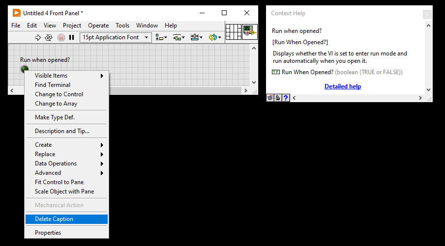
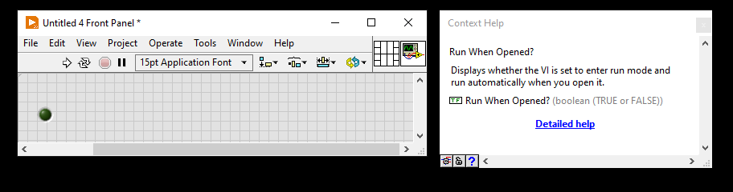

# Delete-Caption-Plugin

This edit-time plugin deletes the captions of all controls selected. The plugin is configured such that the menu item only appears if every control selected has a caption.

 

I noticed while trying to make my controls' Context Help look the way I wanted to, that there is no built-in way to delete a caption. To my knowledge, the only non-scripting way of doing so would be to remake the control. This plugin provides an easy way to do it.

 

Before:
 

 

After:

 

Attachment is saved in LabVIEW 2020.

If you find this plugin helpful, please consider starring this repo and kudoing the plugin at [Delete Caption.llb](https://forums.ni.com/t5/LabVIEW-Shortcut-Menu-Plug-Ins/Delete-Caption-llb/ta-p/4473428).

## Installing

To install this plugin for your LabVIEW environment, see [How to install plug-ins that you download](https://forums.ni.com/t5/LabVIEW-Shortcut-Menu-Plug-Ins/How-to-install-plug-ins-that-you-download/ta-p/3517848).